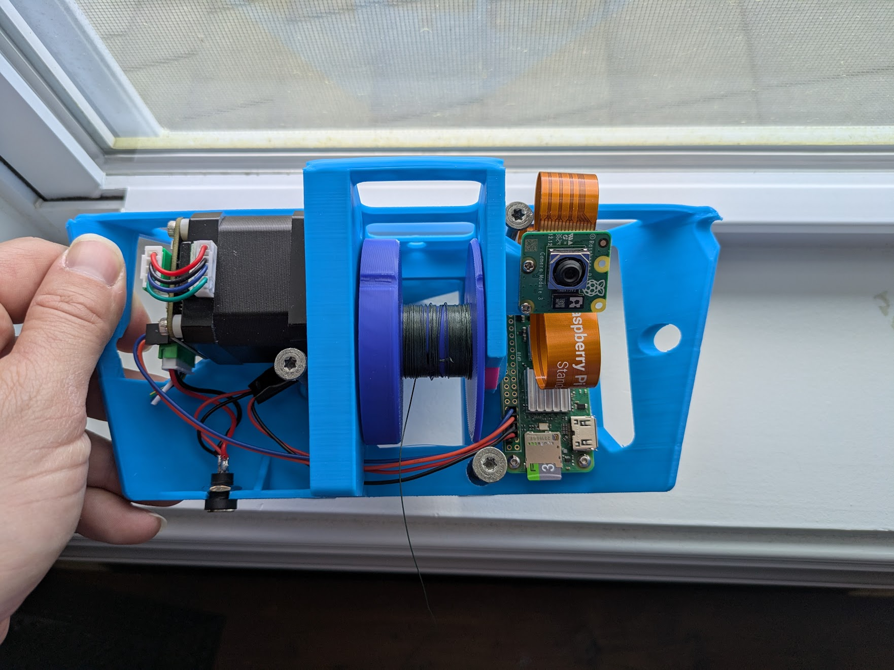
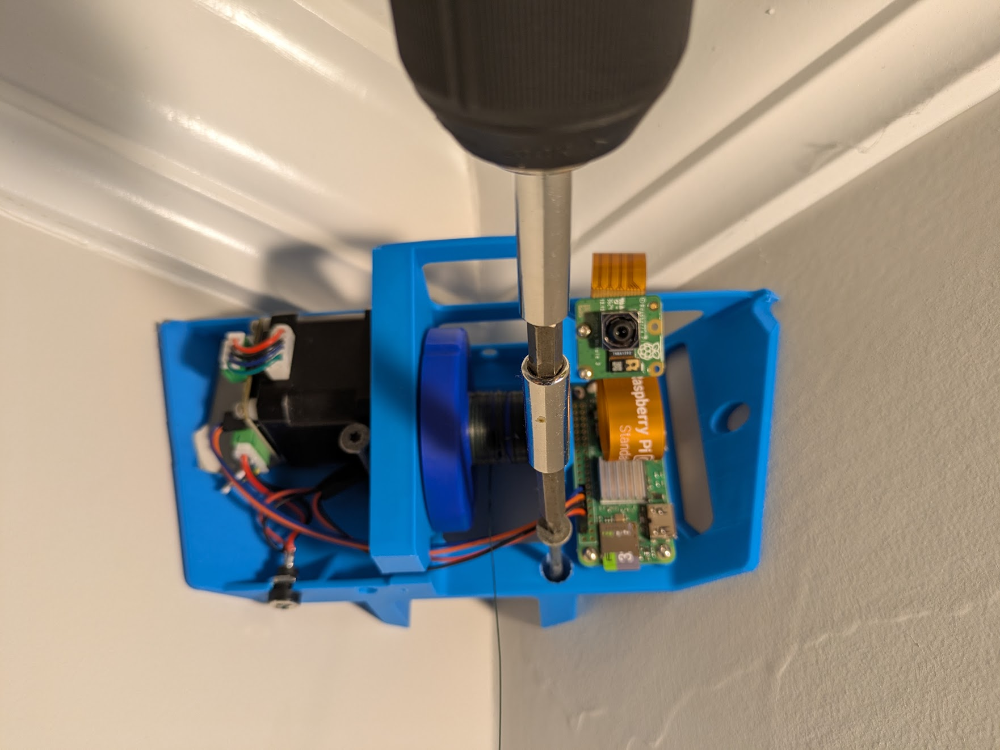
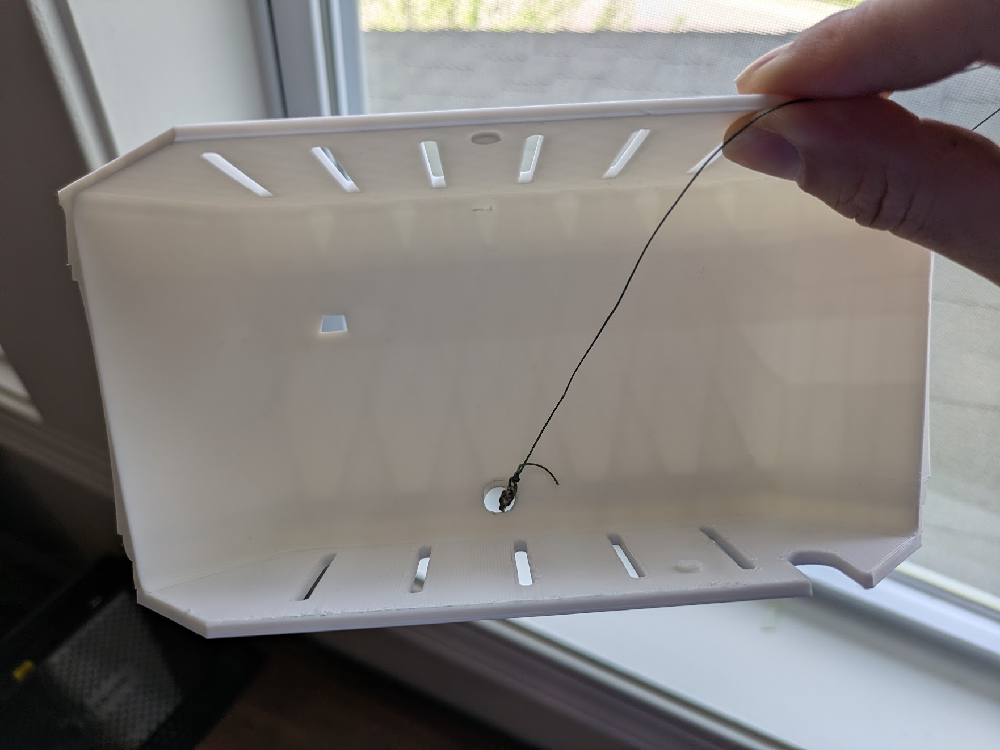
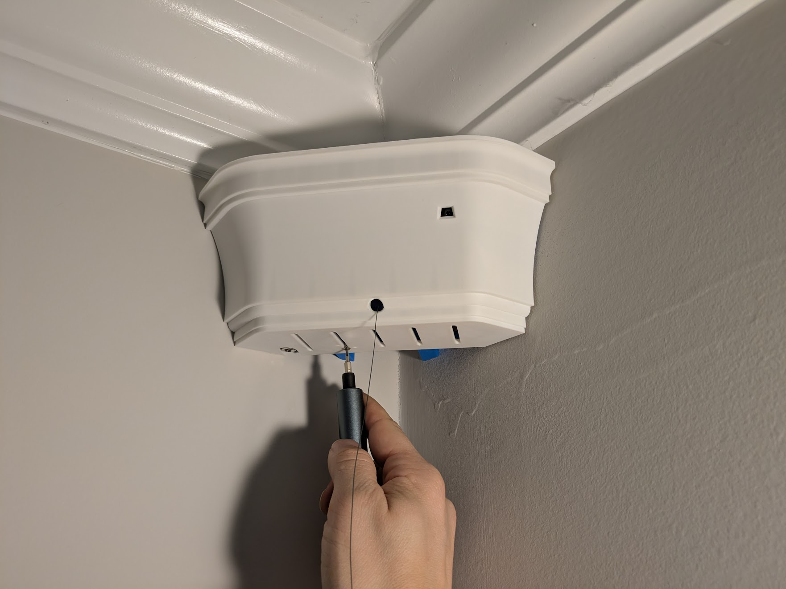
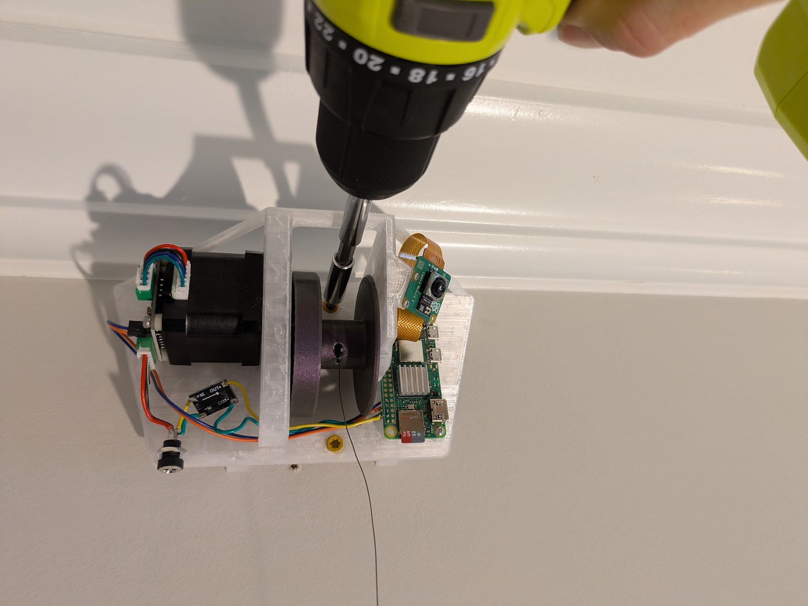
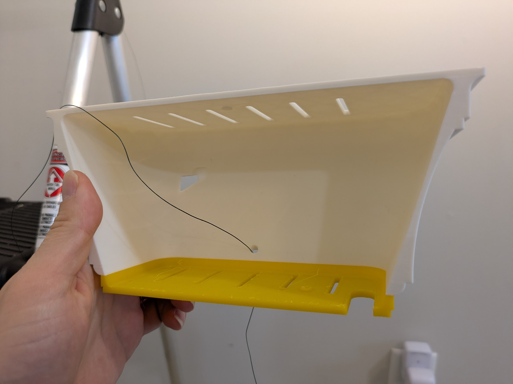
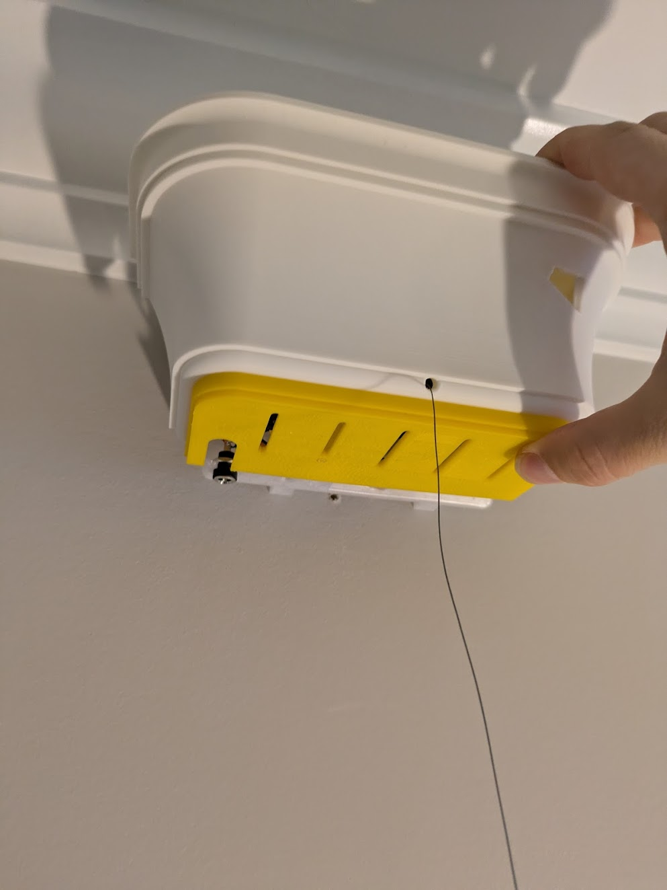
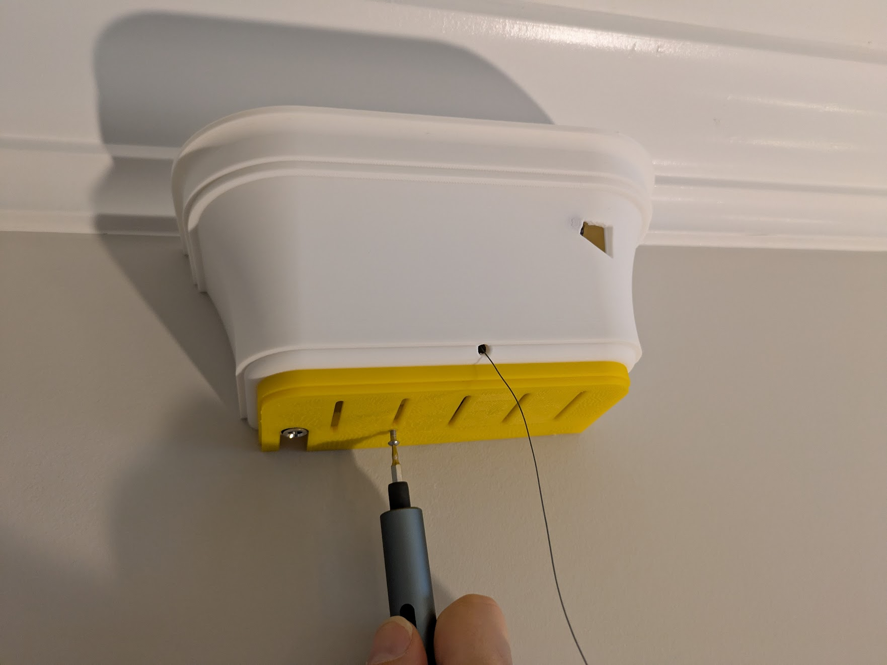

# Final Installation Guide

Hardware Version: Pilot run

Hardware installation of a preassembled or diy assembled Stringman robot.

Tools needed:  

 - Step ladder
 - Handheld drill/driver

Hanging the robot in the room where it will operate involves installing an anchor in each corner, and attaching each of the three support lines to the gantry. support lines refer to the fishing line, while power line refers to the conductor.

## Anchor installation

Start with the three support anchors. You will have received or assembled corner or flat variants appropriate your space.
Installation only differs in how they look and where the screws are. 

Partially install the wood screws into every open screw hole in every anchor until the point just protrudes from the back.

{ loading=lazy, width=45% }

=== "Corner"
    
    Hold the anchor securely in the corner with about 2cm of clearance to the ceiling, or to the moulding. Don't push it right up against the moulding as you need space for the cover. Drive in every screw.

    { loading=lazy, width=45% }
    
	!!! note "Note"
	    You won't have to search for studs since the corners of walls in typical "stick framed" american houses will have at least one 2x4 in the corner on one side or the other. If you believe there is no stud in the corner somehow, you need to install a backer board.  
        
	    If you think you are in a building with steel or aluminum framing, please consult a professional. it is probably possible to bolt the anchor to the stud with the right hardware.
    
	Thread the line through the hole at the bottom of the cover from the inside to the outside.

	{ loading=lazy, width=45% }
    
	Snap on the cover. Secure it at the bottom with an M2.5x6 screw.

	{ loading=lazy, width=45% }

=== "Flat"	
    
    When installing a flat wall anchor, confirm the camera would point towards the center of the work area.  
    Find a stud in the wall near the installation spot. I prefer to use neodymium magnets to locate the drywall scews.
    
    Hold the anchor securely onto the wall with the screw holes aligned to the stud and about 2cm of clearance to the ceiling, or to the moulding. Don't push it right up against the moulding as you need space for the cover. Drive in every screw.

    { loading=lazy, width=45% }
    
	Thread the line through the hole at the bottom of the cover from the inside to the outside.
	Sorry about the yellow. I ran out of white.

	{ loading=lazy, width=45% }
    
	Snap on the cover. Secure it at the bottom with an M2.5x6 screw.

	{ loading=lazy, width=45% }
	{ loading=lazy, width=45% }

Plug in the anchor via one of the provided outlet remotes. The outlet remote serves as a low tech kill switch that's immune to software bugs, and serves as your main power on/off switch since the Pilot version has no global sleep mode.

{ loading=lazy, width=45% }

## Power Anchor

For the power anchor the cover will already have been threaded onto the wire. If it is snapped on already, remove it and slide it down the wire. Gently unspool a few meters of wire so the gantry and gripper can lay on the floor in the center of the room while you install the anchor. Drive in the screws as before, and snap the cover back on and secure it with the M2.5x6 screw.

## Tie up

Lay the gripper, gantry, and power wire on the floor in the center of the room. with the gantry oriented so the power line goes straight out towards the anchor and isn't wrapped around anything.

Gently pull out enough line from each anchor to reach the gantry. If you feel bumping while pulling out line, this is normal. it is an electrical phenomenon involving the stepper driver.

Hook each eyelet to the corresponding hook on the gantry.

Power on the whole system, open the [control panel](usage_guide.md), and select "Auto tension" from the main menu.