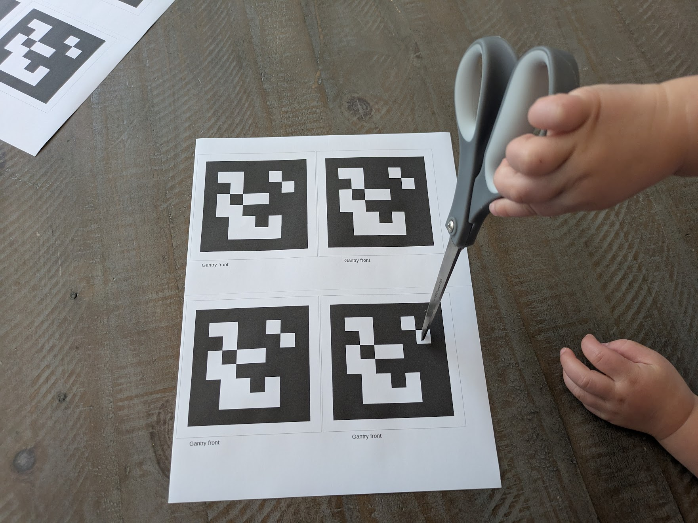
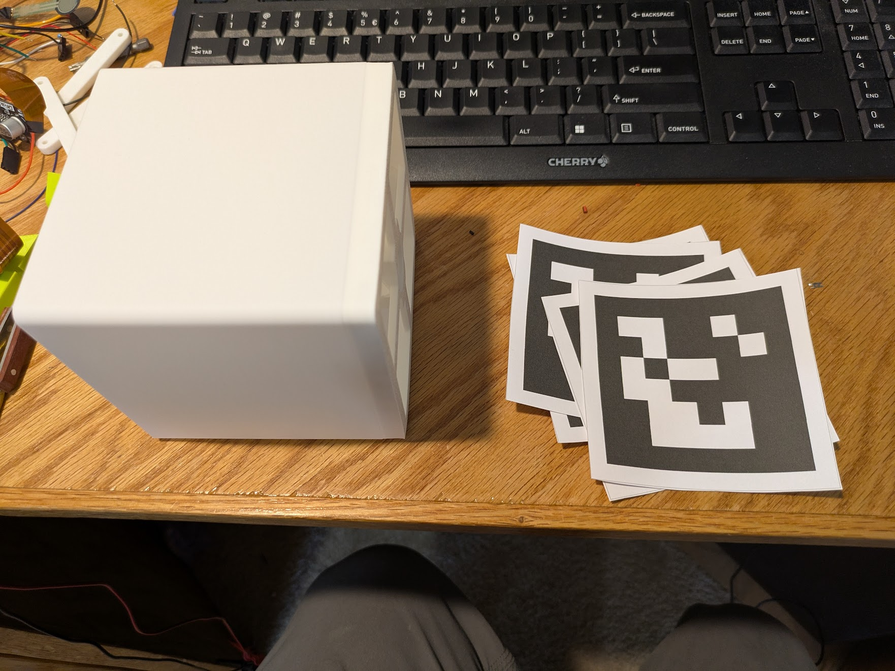
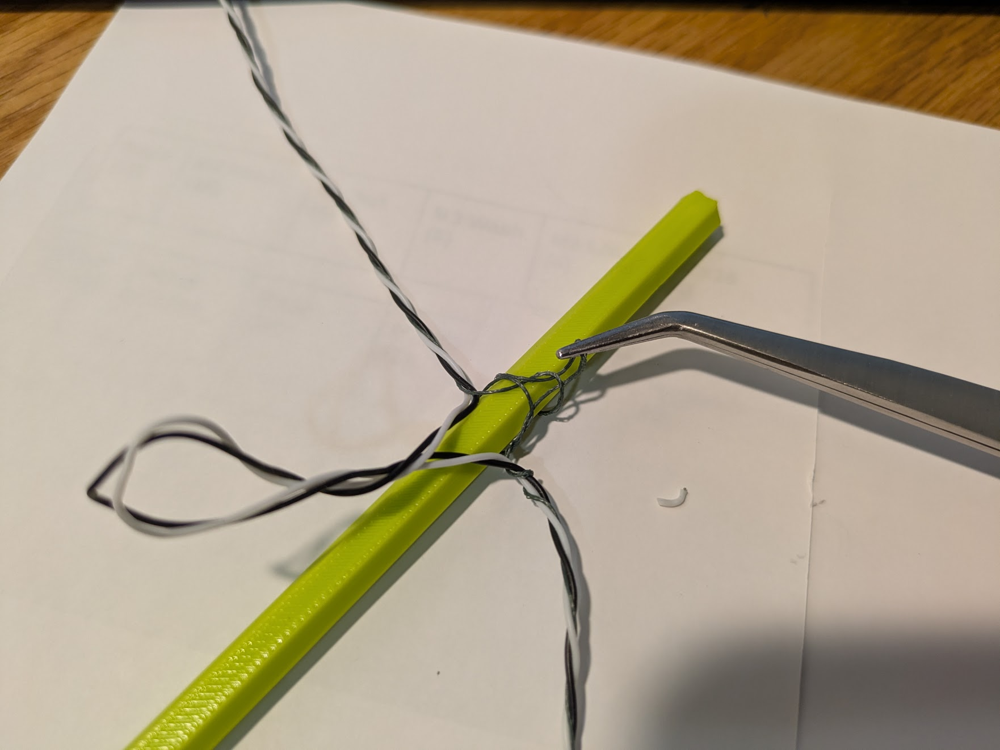
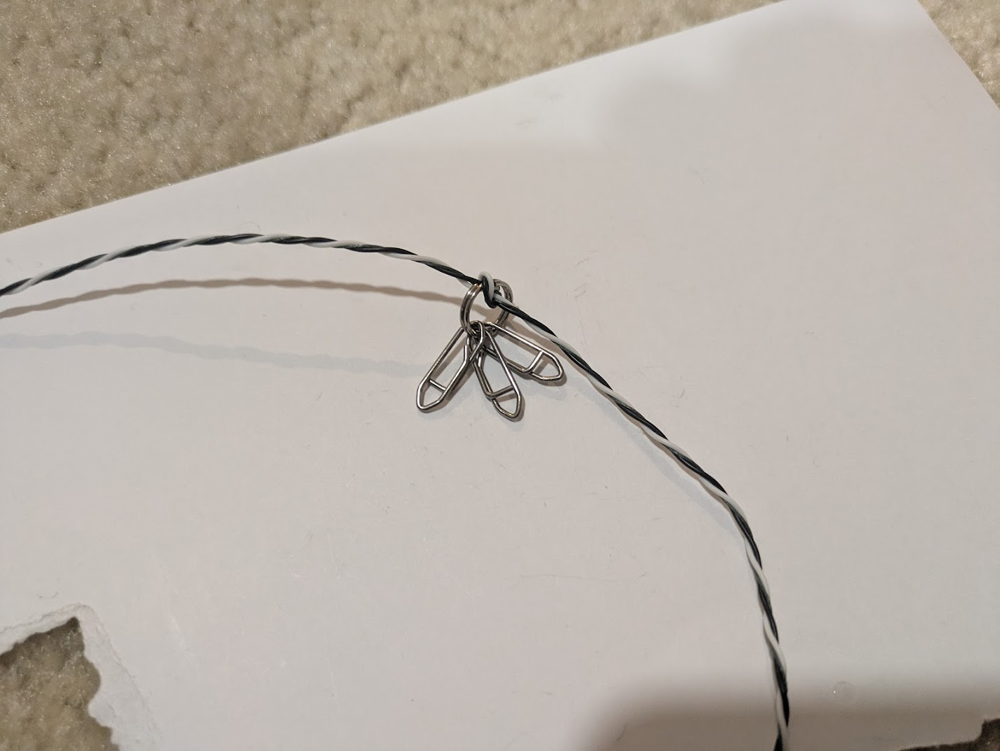
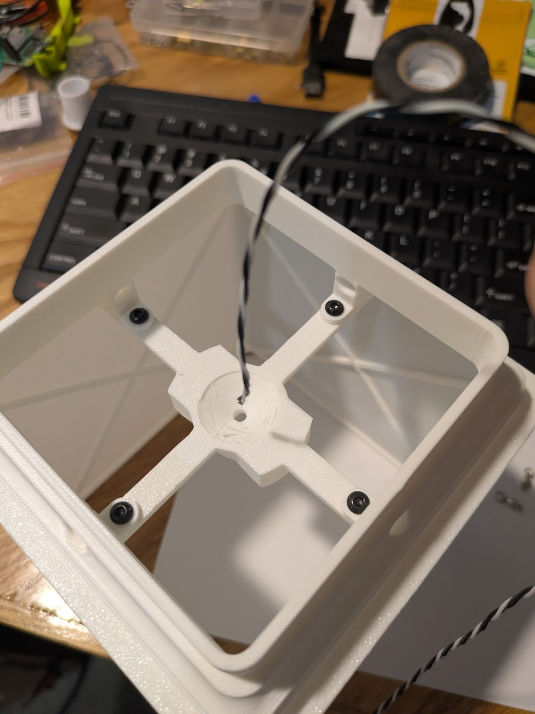
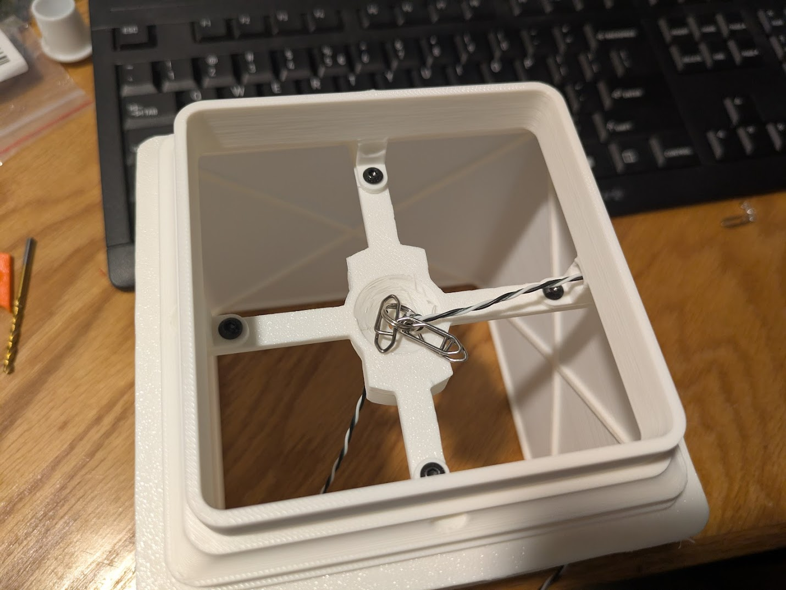

# Powerline/Gantry Build Guide

Hardware Version: Pilot run

Coveres the connetion of the power line between the power anchor and gripper, gantry assembly, and tie up of the fishing lines.
This is meant to be done **before** [final installation](installation_guide.md).

Tools needed:  

 - Scissors
 - Wire strippers
 - Super glue
 - Lighter or heat gun for heat shrink tubing

!!! tip "Warning"

    PLA will soften and is flammable. Direct any heat source used to shrink tubing away from it.

## Gantry

The gantry refers to a passive component that hangs where all the anchor lines meet. A fudicial marker is displayed on four sides of a hollow box. The markers have to be fairly large (10cm on a side) for the cameras several meters away to determine their position and orientation in the room.

Print the components of the gantry in a white or light colored filament with two walls and 12% cubic infill. Attach them together with four M3x4 screws. 

# Stickers

You should have received four copies of the “gantry_front” aruco marker on sticker paper. Cut out the stickers with a ruler and an exacto knife along the thin dotted line, which leaves a 1cm border around the marker. If you need to print the stickers again, You can find the [document here](https://docs.google.com/document/d/1uWInzjaWLs-bZ3f5-mjPZeAdHX51PbgfzJ0FCqzDZFw/edit?usp=sharing) and the [paper on amazon](https://www.amazon.com/dp/B092444Z49)

{ loading=lazy, width=45% }
{ loading=lazy, width=45% }

To more easily remove the backing, make a gentle cross cut into the corner of the backing with the knife with only enough pressure to cut the backing, but not the sticker.
Put one sticker on each face of the gantry. They must be oriented correctly. The word “gantry_front” is printed at the bottom of each. Note that the top of the gantry is the part where the second part was screwed on. Refer to this image of the marker for the correct orientation

{ loading=lazy, width=15% }

## Fishing Lines

Cut three 16 inch (40cm) lengths of fishing line. Tie each one to the keyring with a [palomar knot](https://www.animatedknots.com/palomar-knot).
Before performing this assembly, I reccomend practicing the palomar knot on regular rope on something else.

{ loading=lazy, width=45% }
{ loading=lazy, width=45% }

Tie a quick release hook to each one, about 6cm to 10cm from the ring. Tie onto the hook, not the swivel.
Why trying to create a palomar knot at a given length, you may have to pull all the slack in the loop out from the tail. Once the knot is right, you have to pull pretty hard to do that, grabbing the tail with pliers is sometimes necessary, but try not to grab the working line with pliers as it would signifigantly weaken it.

{ loading=lazy, width=45% }
{ loading=lazy, width=45% }
{ loading=lazy, width=45% }

## Power line

Thread 2 meters of your power wire through the 10mm keyring. This should leave 8 meters on the other end. Thread the short end through the keyring again, and tie a double 
Black wire is pictured here, but I will be supplying white in future kits.
Lead the 2 meter tail from the top, down through the center hole of the gantry. Lead the 8 meter tail out through one of the side holes. The keyring will ultimately rest in the center of the object, but for now, pull it out a bit where you can reach it while tying on other lines.
